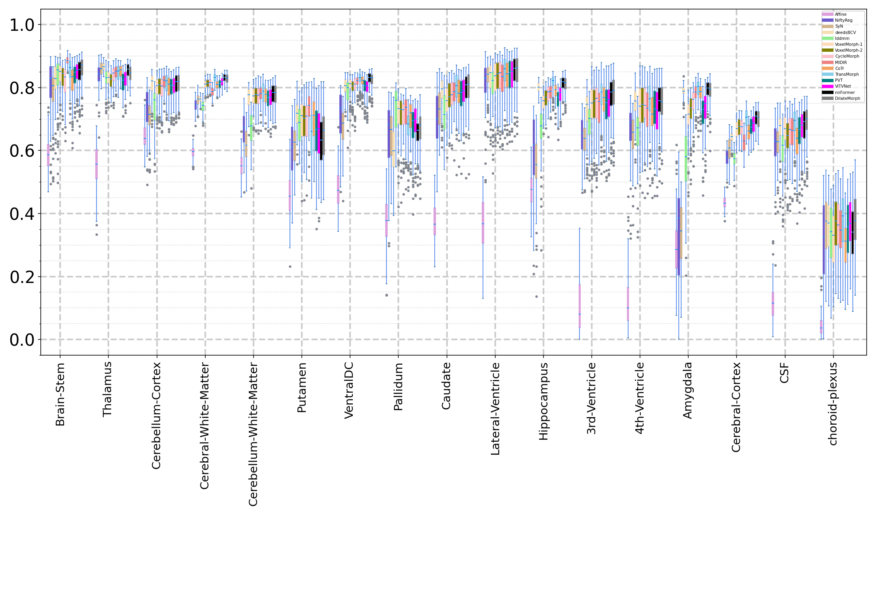

This page presents the implementation results of our model on the IXI dataset.

The IXI dataset can be accessed through the following link: [IXI Dataset](https://github.com/junyuchen245/TransMorph_Transformer_for_Medical_Image_Registration/blob/main/IXI/TransMorph_on_IXI.md). The authors of TransMorph have preprocessed this dataset and made it available for download. 

Contact

Should you have any queries or require further information, please do not hesitate to contact us.

Results

We present below some of the obtained results, a detailed description will be completed in the future.

